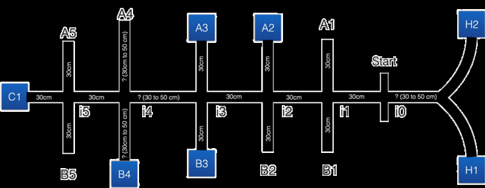

# Advanced Mechatronics — NYU

We built robots. Three of them, over one semester, each one smarter than the last.

**Group 19:** Dajr Alfred, Mohammed Nauman Shariff, Gordon Oboh

---

*The track — a grid inspired by Manhattan and Brooklyn streets. The robot starts at H1 or H2 and navigates through intersections to deliver test kits, avoid obstacles, and identify friend or foe.*

---

## The Projects

### 1. The Arduino Robot

Our first robot. An Arduino Nano with an 8-sensor IR array to follow a black line, three ultrasonic sensors to detect objects, and a pair of servo motors for wheels. It navigates a parking-lot track, stops at intersections, and approaches detected objects within 7cm.

**What it does:** Follows a line, finds objects, stops in front of them.

<video src="Arduino%20Project/Demonstration.mp4" width="600" controls></video>

*Robot navigating the track and approaching an object*

[▶ Read more →](Arduino%20Project/README.md)

---

### 2. The Propeller Robot

Same task, smarter brain. We swapped the single-core Arduino for a **Parallax Propeller** with 8 parallel cores (COGs), using the Arduino as a sensor reader. Now the robot could follow the line, scan for obstacles, control its wheels, and flash indicators — all at the same time.

**What's new:** Multi-core processing means it doesn't have to stop and scan anymore. It can handle obstacle avoidance on a full grid track with 16 intersections and 10 delivery points.

*The Propeller robot with Arduino, QTR sensor, ultrasonic sensors, and servos*

<video src="Propeller%20Project/IMG_2307.mp4" width="600" controls></video>

*Robot navigating the grid track with obstacle avoidance*

[▶ Read more →](Propeller%20Project/README.md)

---

### 3. The Term Project — Friend or Foe?

This is where it gets fun. We added a **Raspberry Pi with a camera** to the Propeller + Arduino setup. Now the robot can *see*. It detects ArUco markers and decides if they're a friend or an enemy.

- **Friend (ID ≤ 9):** *"Hasta La Vista, Baby"* plays. The robot leaves them alone.
- **Foe (ID > 9):** *"MK.mp3"* plays. The arm servo deploys.

Three processors, one robot, and a whole lot of personality.

<video src="Term%20Project/Demo%20Video.mp4" width="600" controls></video>

*Robot scanning for ArUco markers and identifying friend or foe*

[▶ Read more →](Term%20Project/README.md)

---

## Hardware Evolution

| Component | Arduino Project | Propeller Project | Term Project |
|-----------|:---------------:|:-----------------:|:------------:|
| Arduino Nano | ✓ QTR reader + control | ✓ QTR reader only | ✓ QTR reader only |
| Propeller | — | ✓ Master controller | ✓ Master controller |
| Raspberry Pi 3B | — | — | ✓ Vision processing |
| Camera Module V2 | — | — | ✓ ArUco detection |
| Pololu QTR-8RC | ✓ | ✓ | ✓ |
| HC-SR04 / Ping))) | 3x | 3x | 3x |
| Servo motors | 2x drive | 2x drive | 2x drive + 1x arm |
| LEDs | Blue + Red | 2x | 2x |
| Buzzer | — | ✓ | ✓ |

## Software Evolution

| Capability | Arduino | Propeller | Term |
|------------|:-------:|:---------:|:----:|
| Line-following | ✓ | ✓ | ✓ |
| Intersection detection | ✓ | ✓ | ✓ |
| Ultrasonic object scan | ✓ | ✓ | ✓ |
| Multi-core parallelism | — | ✓ | ✓ |
| Obstacle avoidance | — | ✓ | ✓ |
| Grid track navigation | — | ✓ | ✓ |
| ArUco marker detection | — | — | ✓ |
| Friend/Foe classification | — | — | ✓ |
| Servo arm actuation | — | — | ✓ |
| Audio cues | — | — | ✓ |

---

## What's in the repo

| Folder | Contains |
|--------|----------|
| [`Arduino Project/`](Arduino%20Project/) | Code, report, and demo video of the Arduino line-follower |
| [`Propeller Project/`](Propeller%20Project/) | Propeller + Arduino code, report, demo, and robot photo |
| [`Term Project/`](Term%20Project/) | Propeller + Arduino + RPi code, report, demo videos, audio files |

See [`File_Desc.md`](File_Desc.md) for the full breakdown of every file.
